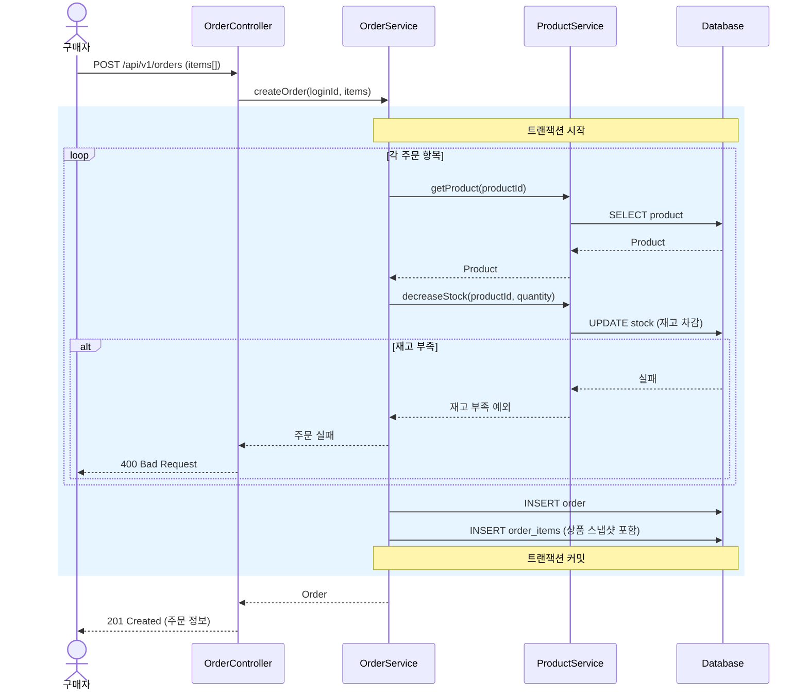
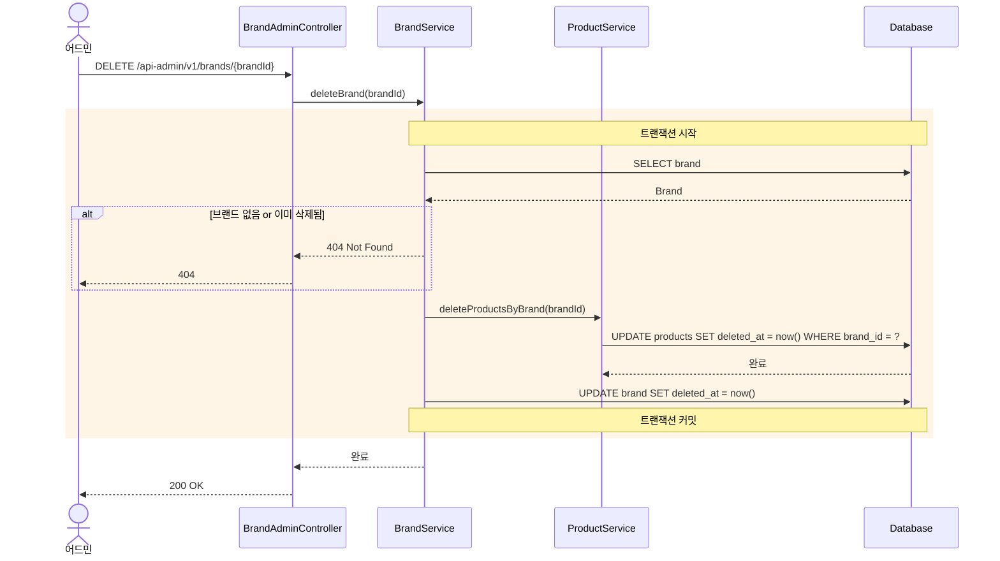
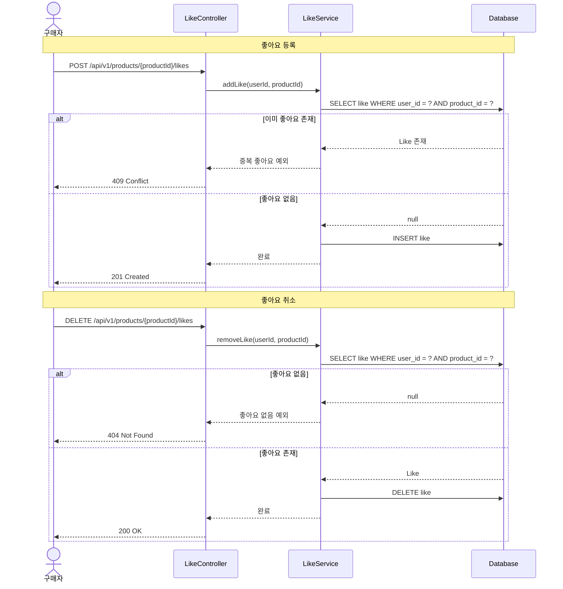

# 시퀀스 다이어그램

> 주요 유스케이스별 시퀀스 다이어그램 (Mermaid)

---

## 1. 주문 생성 플로우

### 목적
주문 생성 시 재고 확인 → 차감 → 스냅샷 저장이 하나의 트랜잭션 안에서 어떤 순서로 일어나는지 확인한다.
특히 재고 부족 시 실패 흐름과, 여러 상품을 한 번에 처리할 때의 경계를 검증한다.

### 핵심 포인트
- 재고 확인과 차감은 **같은 트랜잭션** 안에서 수행하여 정합성을 보장한다
- 여러 상품 중 하나라도 재고 부족이면 **전체 주문이 롤백**된다
- 주문 항목(order_item)에는 당시 상품명, 가격, 브랜드명이 스냅샷으로 저장된다

---

## 2. 브랜드 삭제 플로우

### 목적
브랜드 삭제 시 하위 상품들이 연쇄적으로 소프트 삭제되는 흐름을 확인한다.
삭제가 기존 주문 데이터에 영향을 주지 않는 구조인지 검증한다.

### 핵심 포인트
- **소프트 삭제** 방식이므로 데이터는 DB에 남아있고, 기존 주문 스냅샷에 영향 없음
- 브랜드와 상품의 삭제가 **하나의 트랜잭션**으로 묶여 중간 실패 시 모두 롤백됨
- 삭제된 상품은 고객 조회(`deletedAt IS NULL` 필터)에서 자동 제외

---

## 3. 좋아요 등록/취소 플로우

### 목적
좋아요 등록과 취소 시 중복 방지 로직이 어떻게 동작하는지 확인한다.

### 핵심 포인트
- 좋아요는 **물리 삭제** — 소프트 삭제와 달리 취소하면 row 자체를 제거한다 (좋아요 이력 보존 불필요)
- `(user_id, product_id)` 유니크 제약으로 DB 레벨에서도 중복 방지
- 좋아요 수 집계는 좋아요 테이블의 COUNT로 처리 (비정규화는 추후 검토)
