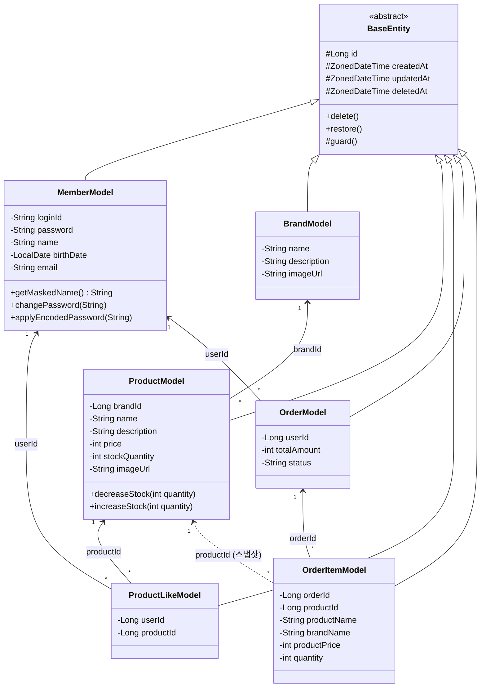

# 클래스 다이어그램

> 도메인 객체 설계 (Mermaid)

---

## 목적

* 도메인 객체 간의 책임과 의존 방향을 정리한다.
* 기존 프로젝트의 `BaseEntity` 상속, `*Model` 네이밍 컨벤션을 따른다.

---
## 전체 도메인 클래스 다이어그램

---

## 설계 포인트

### 연관관계 방향
- 모든 연관관계는 **ID 참조(단방향)**로 설계한다. JPA `@ManyToOne` 양방향 매핑을 피하고, 필요 시 조회 쿼리로 해결한다.
- `OrderItemModel → ProductModel`은 점선(의존) — 스냅샷이므로 실제 FK가 아닌 참고용 참조

### 도메인 객체별 책임

| 클래스 | 핵심 책임 |
|--------|-----------|
| `BrandModel` | 브랜드 정보 보유. 별도 비즈니스 로직 최소화 |
| `ProductModel` | 상품 정보 + 재고 관리. `decreaseStock()`에서 재고 부족 시 예외 발생 |
| `ProductLikeModel` | 유저-상품 좋아요 관계 표현. 비즈니스 로직 없음 (관계 테이블 역할) |
| `OrderModel` | 주문 헤더. 주문자, 총액, 상태 보유 |
| `OrderItemModel` | 주문 상세. 주문 당시의 상품 스냅샷(이름, 가격, 브랜드명) 보유 |

### 재고 차감 로직 위치
- `ProductModel.decreaseStock(quantity)` — 도메인 객체 내부에서 재고 유효성 검증
- 재고 부족 시 `CoreException` 발생

### 주문 상태
- 현재는 단순 문자열. 결제 도입 시 Enum(`CREATED`, `PAID`, `CANCELLED` 등)으로 전환 검토
