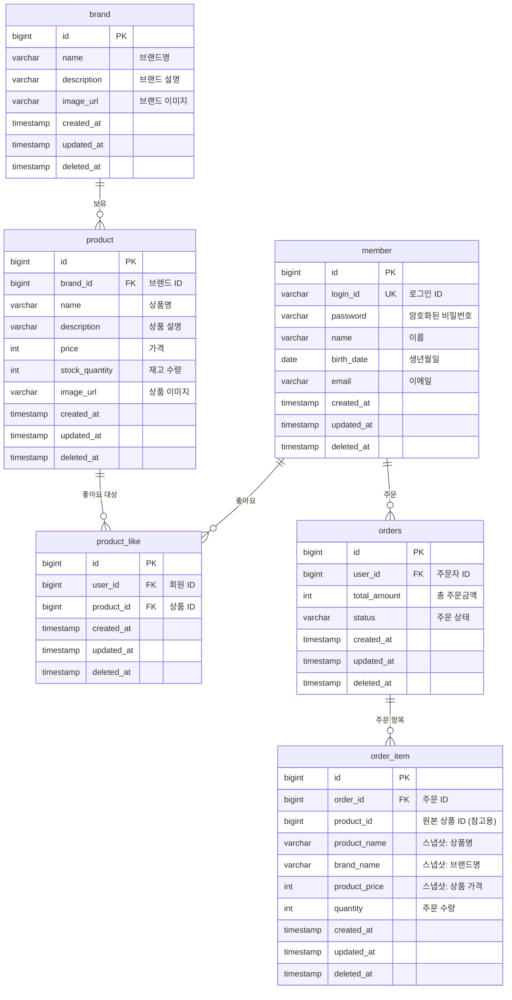

# ERD

> 전체 테이블 구조 및 관계 정리 (Mermaid)

---

## 목적

영속성 계층의 테이블 구조, 컬럼 타입, 관계를 정리한다.
모든 테이블은 `BaseEntity`의 공통 컬럼(`id`, `created_at`, `updated_at`, `deleted_at`)을 포함한다.

---

## 전체 ERD

---

## 테이블별 설명

### `member`
- 기존 구현 완료. `login_id`에 유니크 제약.

### `brand`
- 브랜드 기본 정보. 소프트 삭제 시 하위 `product`도 연쇄 소프트 삭제.

### `product`
- `brand_id`로 브랜드 참조 (변경 불가).
- `stock_quantity`는 주문 시 차감, 0 미만 불가.
- 소프트 삭제된 상품은 고객 조회에서 제외.

### `product_like`
- `(user_id, product_id)` 유니크 제약 + `deleted_at IS NULL` 조건으로 중복 좋아요 방지.
- 좋아요 취소 시 소프트 삭제 (`deleted_at` 설정). 실수 대비 복구 가능.

### `orders`
- 테이블명이 `orders`인 이유: `order`는 SQL 예약어.
- `status`: 현재는 `CREATED` 고정. 결제 도입 시 `PAID`, `CANCELLED` 등 확장.
- `total_amount`: 주문 항목의 `price * quantity` 합산.

### `order_item`
- 주문 당시의 상품 정보를 **스냅샷**으로 보관.
- `product_id`는 FK가 아닌 참고용. 원본 상품이 삭제되어도 주문 이력 유지.
- `product_name`, `brand_name`, `product_price`는 주문 시점 값 고정.

---

## 인덱스 후보

| 테이블 | 컬럼 | 용도 |
|--------|------|------|
| `product` | `brand_id` | 브랜드별 상품 필터링 |
| `product` | `price` | 가격순 정렬 |
| `product_like` | `(user_id, product_id)` | 유니크 제약 + 중복 체크 |
| `product_like` | `product_id` | 상품별 좋아요 수 COUNT |
| `orders` | `user_id, created_at` | 유저별 주문 목록 날짜 필터 |
| `order_item` | `order_id` | 주문별 항목 조회 |
